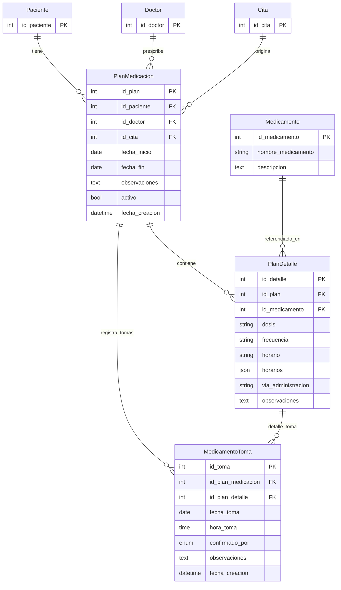

# Modelo de Planes de Medicación y Medicamentos de Pacientes

Documento que describe cómo están modeladas las tablas de planes de medicación y medicamentos, cómo se almacenan y cómo se muestran en la aplicación.

---

## 1. Tablas y estructura (modelado actual)

### 1.1 `planes_medicacion` (PlanMedicacion)

Cada fila es un **plan de medicación** asociado a un paciente: agrupa varios medicamentos con fecha de inicio/fin y observaciones.

| Columna        | Tipo        | Nulo | Descripción |
|----------------|-------------|------|-------------|
| `id_plan`      | INTEGER PK  | No   | Identificador del plan |
| `id_paciente`  | INTEGER FK  | No   | Paciente al que pertenece el plan |
| `id_doctor`    | INTEGER FK  | Sí   | Doctor que prescribe |
| `id_cita`      | INTEGER FK  | Sí   | Cita en la que se prescribió (opcional) |
| `fecha_inicio` | DATEONLY    | Sí   | Inicio del tratamiento |
| `fecha_fin`    | DATEONLY    | Sí   | Fin del tratamiento |
| `observaciones`| TEXT        | Sí   | Observaciones del plan (encriptadas AES-256-GCM) |
| `activo`       | BOOLEAN     | Sí   | Si el plan está activo (default true) |
| `fecha_creacion`| DATE       | Sí   | Fecha de creación del registro |

- **Relaciones:** Pertenece a `Paciente`, `Doctor` y opcionalmente a `Cita`. Tiene muchos `PlanDetalle` y muchos `MedicamentoToma`.

---

### 1.2 `plan_detalle` (PlanDetalle)

Cada fila es **un medicamento dentro de un plan**: dosis, frecuencia, horario(s), vía de administración.

| Columna             | Tipo        | Nulo | Descripción |
|---------------------|-------------|------|-------------|
| `id_detalle`        | INTEGER PK  | No   | Identificador del detalle |
| `id_plan`           | INTEGER FK  | No   | Plan de medicación al que pertenece |
| `id_medicamento`    | INTEGER FK  | No   | Medicamento (catálogo) |
| `dosis`             | VARCHAR(100)| Sí   | Ej: "1 tableta", "500 mg" |
| `frecuencia`         | VARCHAR(100)| Sí   | Ej: "Cada 8 horas", "Una vez al día" |
| `horario`           | VARCHAR(100)| Sí   | Horario único (compatibilidad) |
| `horarios`          | JSON        | Sí   | Array de horarios: `["08:00","20:00"]` |
| `via_administracion`| VARCHAR(50) | Sí   | Oral, sublingual, etc. |
| `observaciones`     | TEXT        | Sí   | Observaciones del detalle (encriptadas) |

- **Relaciones:** Pertenece a `PlanMedicacion` y a `Medicamento`. Tiene muchos `MedicamentoToma` (registro de tomas).

---

### 1.3 `medicamentos` (Medicamento)

Catálogo de medicamentos (no es por paciente). Se reutiliza en todos los planes.

| Columna             | Tipo         | Nulo | Descripción |
|---------------------|--------------|------|-------------|
| `id_medicamento`    | INTEGER PK  | No   | Identificador |
| `nombre_medicamento`| VARCHAR(150) | No   | Nombre (único) |
| `descripcion`       | TEXT         | Sí   | Descripción del medicamento |

- **Relaciones:** Tiene muchos `PlanDetalle`. No tiene FK a paciente ni a plan.

---

### 1.4 `medicamento_toma` (MedicamentoToma)

Registro de **cada toma** que el paciente (o familiar/doctor) confirma.

| Columna            | Tipo        | Nulo | Descripción |
|--------------------|-------------|------|-------------|
| `id_toma`          | INTEGER PK  | No   | Identificador de la toma |
| `id_plan_medicacion`| INTEGER FK  | No   | Plan de medicación |
| `id_plan_detalle`  | INTEGER FK  | Sí   | Detalle concreto (medicamento dentro del plan) |
| `fecha_toma`       | DATE        | No   | Fecha en que se tomó |
| `hora_toma`        | TIME        | Sí   | Hora de la toma |
| `confirmado_por`   | ENUM        | No   | 'Paciente', 'Doctor', 'Familiar' |
| `observaciones`     | TEXT        | Sí   | Observaciones |
| `fecha_creacion`    | DATE        | Sí   | Momento del registro |

- **Relaciones:** Pertenece a `PlanMedicacion` y opcionalmente a `PlanDetalle`.

---

## 2. Cómo se almacenan los datos

1. **Catálogo:** Los medicamentos se guardan en `medicamentos` (nombre, descripción). Se crean/actualizan por API de administración (`/api/medicamentos`).
2. **Plan:** Al crear un plan para un paciente (`POST /api/pacientes/:id/planes-medicacion`) se inserta una fila en `planes_medicacion` (id_paciente, id_doctor, id_cita opcional, fecha_inicio, fecha_fin, observaciones, activo).
3. **Detalles del plan:** Por cada medicamento del plan se inserta una fila en `plan_detalle` (id_plan, id_medicamento, dosis, frecuencia, horario/horarios, via_administracion, observaciones).
4. **Encriptación:** Los campos `observaciones` de `planes_medicacion` y `plan_detalle` se encriptan con AES-256-GCM antes de guardar (hooks en `encryptionHooks.js`) y se desencriptan al leer (middleware `autoDecryptResponse` en rutas de paciente).
5. **Tomas:** Cuando el paciente marca “tomado”, se inserta una fila en `medicamento_toma` (id_plan_medicacion, id_plan_detalle opcional, fecha_toma, hora_toma, confirmado_por).

---

## 3. Cómo se muestran los datos

### 3.1 API: GET `/api/pacientes/:id/medicamentos`

- Se consultan todos los `PlanMedicacion` del paciente con `include` de `Doctor`, `PlanDetalle` y `Medicamento`.
- La respuesta se **aplana**: por cada combinación plan + detalle se devuelve un objeto con:
  - `id_plan`, `id_medicamento`, `nombre_medicamento`, `descripcion`, `dosis`, `frecuencia`, `horario`, `horarios`, `via_administracion`, `observaciones`, `fecha_inicio`, `fecha_fin`, `estado`, `doctor_nombre`.
- No se incluye `id_detalle` (id_plan_detalle) en la respuesta; la app lo usa para registrar la toma, por lo que convendría añadirlo en el futuro.

### 3.2 App móvil (paciente): “Mis Medicamentos”

- **Pantalla:** `ClinicaMovil/src/screens/paciente/MisMedicamentos.js`
- **Origen de datos:** `gestionService.getPacienteMedicamentos(pacienteId)` → GET `/api/pacientes/:id/medicamentos`.
- **Procesamiento:** Se toma el array `data` y se mapea a un formato simplificado: `id`, `id_plan_medicacion`, `id_plan_detalle`, `nombre`, `dosis`, `horario`, `horarios`, `frecuencia`, `tomado`, `duracion`, `observaciones`. El campo `tomado` se rellena cruzando con `gestionService.getTomasMedicamento()` (tomas de hoy).
- **Visualización:** Lista de tarjetas por medicamento (nombre, dosis, horario, si ya fue tomado hoy). El usuario puede marcar “tomado” y se llama a `registrarTomaMedicamento(id_plan_medicacion, id_plan_detalle, ...)`.

### 3.3 App móvil (doctor/admin)

- **Detalle de paciente / historial médico:** Los planes y medicamentos se obtienen vía mismo endpoint o resumen médico (`getPacienteResumenMedico`), y se muestran en pantallas de historial y expediente.
- **Crear/editar plan:** Desde flujos de alta o gestión de paciente se usa `POST /api/pacientes/:id/planes-medicacion` y `PUT /api/pacientes/:id/planes-medicacion/:planId` con body `{ medicamentos: [{ id_medicamento, dosis, frecuencia, horario, horarios, via_administracion, observaciones }], ... }`.

---

## 4. Modelo entidad-relación (tablas de medicación)

```
                    ┌─────────────────┐
                    │    Paciente     │
                    │  id_paciente PK │
                    └────────┬────────┘
                             │ 1
                             │
                             │ N
                    ┌────────▼────────┐         ┌─────────────────┐
                    │ PlanMedicacion  │    N    │     Doctor      │
                    │   id_plan PK    │◄───────►│   id_doctor PK  │
                    │ id_paciente FK  │    1    └─────────────────┘
                    │ id_doctor FK    │
                    │ id_cita FK (opc)│         ┌─────────────────┐
                    │ fecha_inicio    │    N    │      Cita        │
                    │ fecha_fin       │◄───────►│    id_cita PK    │
                    │ observaciones   │    1    └─────────────────┘
                    │ activo          │
                    │ fecha_creacion  │
                    └────────┬────────┘
                             │ 1
                             │
              ┌──────────────┼──────────────┐
              │              │ N            │ N
              │              │              │
       ┌──────▼──────┐       │       ┌──────▼──────────┐
       │ PlanDetalle │       │       │ MedicamentoToma │
       │ id_detalle  │       │       │   id_toma PK    │
       │ id_plan FK  │       │       │ id_plan_medicacion FK
       │ id_medicamento FK   │       │ id_plan_detalle FK
       │ dosis       │       │       │ fecha_toma      │
       │ frecuencia  │       │       │ hora_toma       │
       │ horario     │       │       │ confirmado_por   │
       │ horarios    │       │       │ observaciones   │
       │ via_admin   │       │       └─────────────────┘
       │ observaciones       │
       └──────┬──────┘       │
              │ N            │
              │              │
              │ 1            │
       ┌──────▼──────┐       │
       │ Medicamento │       │
       │ id_medicamento PK    │
       │ nombre_medicamento   │
       │ descripcion  │       │
       └─────────────┘       │
                             │
                    ┌────────┴────────┐
                    │ PlanMedicacion  │
                    │   (continúa)    │
                    └─────────────────┘
```

### Resumen de relaciones

| Entidad          | Relación   | Entidad          | Cardinalidad |
|------------------|------------|------------------|--------------|
| Paciente         | tiene      | PlanMedicacion   | 1:N          |
| Doctor           | prescribe  | PlanMedicacion   | 1:N          |
| Cita             | origina    | PlanMedicacion   | 1:N (opc)    |
| PlanMedicacion   | tiene      | PlanDetalle      | 1:N          |
| Medicamento      | aparece en | PlanDetalle      | 1:N          |
| PlanMedicacion   | tiene      | MedicamentoToma | 1:N          |
| PlanDetalle      | tiene      | MedicamentoToma | 1:N (opc)    |

---

## 5. Diagrama ER en Mermaid (para renderizado en Markdown)



---

## 6. Archivos de referencia en el código

| Qué                | Dónde |
|--------------------|------|
| Modelos Sequelize  | `api-clinica/models/PlanMedicacion.js`, `PlanDetalle.js`, `Medicamento.js`, `MedicamentoToma.js` |
| Asociaciones       | `api-clinica/models/associations.js` (PlanMedicacion, PlanDetalle, Medicamento, MedicamentoToma) |
| Controlador planes/medicamentos paciente | `api-clinica/controllers/pacienteMedicalData.js` (getPacienteMedicamentos, createPacientePlanMedicacion, updatePacientePlanMedicacion, deletePacientePlanMedicacion) |
| Rutas              | `api-clinica/routes/pacienteMedicalData.js` (GET `/:id/medicamentos`, POST/PUT/DELETE `/:id/planes-medicacion`) |
| Encriptación        | `api-clinica/middlewares/encryptionHooks.js` (observaciones en PlanMedicacion y PlanDetalle) |
| Pantalla paciente  | `ClinicaMovil/src/screens/paciente/MisMedicamentos.js` |
| Servicio API app   | `ClinicaMovil/src/api/gestionService.js` (getPacienteMedicamentos, getTomasMedicamento, registrarTomaMedicamento) |

---

*Documento generado a partir del código del proyecto CuidateAPP (planes de medicación y medicamentos).*
